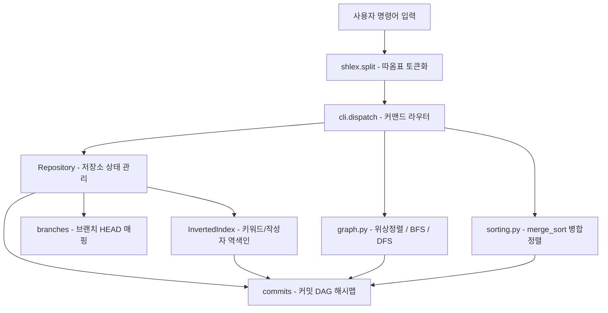

# Mini Git (b5-2) 🚀

> **AI/SW 기초 자료구조와 알고리즘 미션**: 밑바닥부터 직접 구현하는 CLI 기반 Mini Git 커밋 그래프 엔진  
> **공식 미션 명세서**: [`docs/b5_2_mission.md`](docs/b5_2_mission.md) \| **평가표**: [`docs/b5_2_eval.md`](docs/b5_2_eval.md) \| **기술 백과사전**: [`study/study.md`](study/study.md) \| **종합 가이드**: [`study/README.md`](study/README.md)

---

## 📖 1. 프로젝트 개요

**Mini Git**은 Git의 핵심 버전 관리 아키텍처와 커밋 그래프 구조를 깊이 있게 체득하기 위해 순수 Python 표준 라이브러리만으로 개발된 경량 CLI 커밋 그래프 엔진입니다.

외부 서드파티 그래프 패키지(NetworkX 등) 및 내장 정렬 API(`sorted()`, `list.sort()`)를 일체 사용하지 않고, 직접 설계·구현한 **방향성 비순환 그래프(DAG)**, **Kahn 알고리즘 기반 위상 정렬(Topological Sort)**, **무방향 너비 우선 탐색(BFS) 최단 경로 및 사전순 타이브레이크**, **역색인(Inverted Index) 검색 엔진**, 그리고 **분할 정복 안정 병합 정렬(Merge Sort)**을 유기적으로 결합하여 완성되었습니다.

### 🎯 핵심 설계 및 구현 목표
- **커밋 DAG 무결성 보장**: 커밋 노드는 과거의 부모 노드만을 가리켜 사이클 발생이 원천적으로 차단되며, 6자리 단조 카운터/솔트 기반 SHA-1 해시로 세션 내 고유성을 보장.
- **위상 정렬 기반 LOG**: Kahn 알고리즘(진입 차수 추적)을 통해 부모 커밋이 자식 커밋보다 항상 먼저 출력되는 위상 정렬 히스토리 뷰 제공.
- **무방향 BFS 최단 경로(PATH)**: 브랜치 간 경로 탐색을 위해 간선을 무방향으로 모델링하고, 동일 거리 복수 경로 발생 시 문자열 사전순으로 가장 작은 경로를 그리디 역추적으로 결정론적 도출.
- **역색인 기반 $O(1)$ 검색**: 커밋 메시지의 소문자 토큰 및 작성자별 해시 매핑을 생성 시점에 사전 구축하여 검색 시 전체 순회 없이 즉시 반환.
- **안정 병합 정렬 직접 구현**: 표준 정렬 API 금지 제약 하에서 평균/최악 $O(N \log N)$의 안정 정렬을 달성하여 작성자별 정렬 시 생성 순번 보존.
- **철저한 문서화 및 검증**: Google Style docstring 완비, 8대 단위/통합 테스트 스위트 100% 통과.

---

## 🛠️ 2. 개발 및 실행 환경

| 항목 | 명세 |
| :--- | :--- |
| **개발 언어** | Python 3.10 이상 |
| **외부 의존성** | 없음 (표준 라이브러리 `hashlib`, `datetime`, `shlex`만 사용) |
| **코드베이스 제약** | 그래프 라이브러리 및 표준 정렬 API(`sorted()`, `list.sort()`) 사용 엄격 금지 |
| **테스트 스위트** | `python3 test_mini_git.py` (8개 전수 테스트 **100% PASS**) |
| **하네스 도구** | `python3 utils/validate_rules_sync.py`, `python3 utils/validate_mermaid_syntax.py` |

---

## 💻 3. 실행 방법 (Quick Start)

### ① 대화형 CLI REPL 실행
```bash
python3 main.py
```

### ② 대화형 쉘 실행 예시
```text
mini-git> init "Alice"
Initialized repository.
Current branch: main
Current user: Alice

mini-git> commit "Initial commit"
[main 006077] Initial commit

mini-git> branch feature
Created branch: feature

mini-git> switch feature
Switched to branch: feature

mini-git> commit "Add login feature"
[feature c01cec] Add login feature

mini-git> switch main
Switched to branch: main

mini-git> commit "Add payment feature"
[main cf127b] Add payment feature

mini-git> log
commit 006077 (Alice, 2026-10-09 21:00:00)
Initial commit
commit c01cec (Alice, 2026-10-09 21:01:00)
Add login feature
commit cf127b (Alice, 2026-10-09 21:02:00)
Add payment feature

mini-git> path c01cec cf127b
Path: c01cec -> 006077 -> cf127b

mini-git> search "login"
Found 1 commit(s):

- c01cec: Add login feature

mini-git> ancestors cf127b
Ancestors of cf127b:
- 006077: Initial commit

mini-git> log --sort-by=author
commit 006077 (Alice, 2026-10-09 21:00:00)
Initial commit
commit c01cec (Alice, 2026-10-09 21:01:00)
Add login feature
commit cf127b (Alice, 2026-10-09 21:02:00)
Add payment feature
```

---

## 📋 4. 명령어 완전 레퍼런스

| 명령어 | 설명 | 예시 |
| :--- | :--- | :--- |
| `INIT <user_name>` | 저장소 초기화, `main` 브랜치 생성, 현재 사용자 설정 | `init "Alice"` |
| `BRANCH <branch_name>` | 현재 HEAD를 가리키는 새 브랜치 생성 | `branch feature` |
| `SWITCH <branch_name>` | HEAD를 지정한 브랜치로 이동 | `switch feature` |
| `COMMIT <message>` | 현재 HEAD를 부모로 하는 새 커밋 생성 및 역색인 갱신 | `commit "Add login feature"` |
| `LOG` | 부모 커밋이 자식 커밋보다 먼저 출력되는 위상 정렬 로그 | `log` |
| `LOG --sort-by=date\|author` | 날짜 또는 작성자 기준 오름차순 안정 정렬 로그 | `log --sort-by=date` |
| `PATH <commit1> <commit2>` | 두 커밋 사이 최단 경로 탐색 (없으면 `No path`) | `path a1b2c3 d4e5f6` |
| `ANCESTORS <commit_hash>` | 해당 커밋에서 도달 가능한 모든 조상 커밋 목록 출력 | `ancestors d4e5f6` |
| `SEARCH <keyword>` | 키워드가 포함된 커밋들을 역색인 기반으로 검색 | `search "login"` |
| `SEARCH --author=<name>` | 특정 작성자의 커밋들을 역색인 기반으로 검색 | `search --author=Alice` |
| `exit` / `quit` | REPL 쉘 종료 | `exit` |

---

## 🏛️ 5. 아키텍처 및 시스템 흐름도



---

## 📁 6. 프로젝트 폴더 구조

```
/Users/mpeg46551/b5_2/
├── main.py                     # CLI 엔트리 포인트
├── test_mini_git.py             # 8대 전수 단위/통합 테스트 스위트
├── README.md                   # [본 문서] 프로젝트 메인 가이드
├── READYOU.md                  # 구술 평가 대비 상세 대본
├── GEMINI.md / AGENTS.md        # 7대 핵심 운영 규칙 (100% 동기화)
├── src/                        # 핵심 소스코드 패키지
│   ├── commit.py               # Commit 노드 엔티티
│   ├── repo.py                 # Repository 클래스
│   ├── graph.py                # 그래프 탐색 알고리즘
│   ├── index.py                # 역색인(Inverted Index)
│   ├── sorting.py              # 병합 정렬(Merge Sort)
│   └── cli.py                  # CLI REPL 컨트롤러
├── docs/                       # 미션 및 평가 문서
│   ├── b5_2_mission.pdf        # 원본 미션 명세서 PDF
│   ├── b5_2_mission.md         # 미션 명세서 마크다운 변환본
│   ├── b5_2_mission_QA.md      # 미션 심층 Q&A
│   ├── b5_2_eval.pdf           # 원본 평가표 PDF
│   ├── b5_2_eval.md            # 평가표 마크다운 변환본
│   ├── b5_2_eval_QA.md         # 종합 평가문항 5대 항목 답변서
│   └── CONVENTIONS.md          # 커밋 및 코드 컨벤션 지침
├── study/                      # 학습 및 아키텍처 문서
│   ├── README.md               # 프로젝트 종합 아키텍처 가이드
│   └── study.md                # CS 핵심 개념 백과사전
└── utils/                      # 하네스 검증 도구
    ├── validate_rules_sync.py  # 규칙 듀얼 동기화 검증기
    ├── validate_mermaid_syntax.py # Mermaid 문법 검증기
    ├── inspect_codebase_memory.py # Fast Lookup Map 색인 생성기
    └── time_utils.py           # KST 시간 유틸리티
```

---

## 🧪 7. 자체 검증 테스트 실행 방법

```bash
python3 test_mini_git.py
```

### 테스트 실행 결과 (8/8 PASS)
```text
🚀 [Mini Git Test Suite] 단위 및 통합 테스트 시작...
  ✅ 1. 병합 정렬 정렬 정확성 및 안정성 검증 통과
  ✅ 2. 저장소 워크플로우 및 위상 정렬 순서 검증 통과
  ✅ 3. 무방향 최단 경로 및 조상 탐색 검증 통과
  ✅ 4. 역색인 키워드/작성자 검색 검증 통과
  ✅ 5. 최단 경로 사전순 타이브레이크 검증 통과
  ✅ 6. 커밋 해시 유일성 검증 통과
  ✅ 7. CLI 디스패치 및 에러 처리 표준 검증 통과
  ✅ 8. 비연결 그래프 No path 검증 통과
🎉 All 8 tests passed successfully!
```

---

## 🔗 8. 상호 참조 링크 허브 (Cross-References)

- 📝 [미션 명세서 (docs/b5_2_mission.md)](docs/b5_2_mission.md)
- 📝 [미션 심층 Q&A (docs/b5_2_mission_QA.md)](docs/b5_2_mission_QA.md)
- 🎯 [구술/실기 평가표 (docs/b5_2_eval.md)](docs/b5_2_eval.md)
- 🎯 [종합 평가문항 답변서 (docs/b5_2_eval_QA.md)](docs/b5_2_eval_QA.md)
- 📚 [CS 기술 백과사전 (study/study.md)](study/study.md)
- 🏗️ [종합 아키텍처 가이드 (study/README.md)](study/README.md)
- 💡 [구술 평가 대비 질문/답변서 (READYOU.md)](READYOU.md)
- 📜 [커밋 컨벤션 (docs/CONVENTIONS.md)](docs/CONVENTIONS.md)
