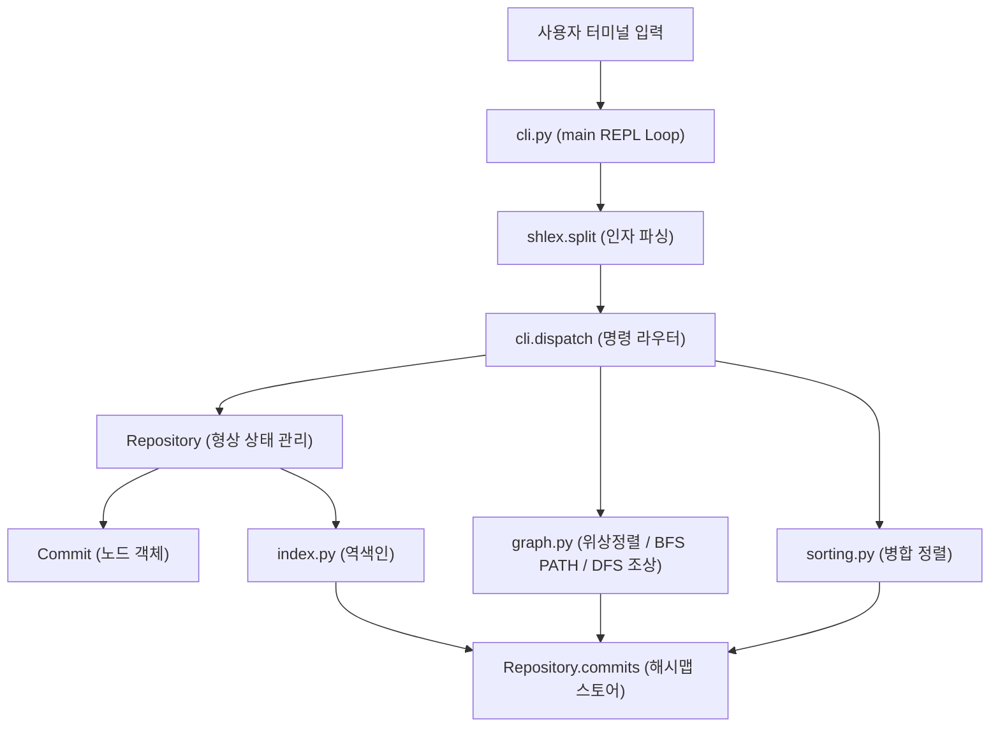

# Mini Git 미션 구현 및 기술 분석 Q&A (b5_2_mission_QA)

본 문서는 [`docs/b5_2_mission.md`](b5_2_mission.md)의 미션 요구사항, 과제 목표, 기능 명세에 대한 심층 기술 답변서입니다.  
모든 구현 항목은 외부 서드파티 그래프 라이브러리 및 Python 내장 정렬 API(`sorted()`, `list.sort()`)를 일체 배제하고 밑바닥부터 직접 구현되었으며, 각 답변에는 해당 소스코드의 상대 경로 링크가 포함되어 있습니다.

> 💡 **연관 핵심 문서 상호 링크**:
> - 📚 **핵심 개념 및 기술 용어 백과사전**: [`study/study.md`](../study/study.md)
> - 🎯 **종합 평가문항 답변서**: [`docs/b5_2_eval_QA.md`](b5_2_eval_QA.md)
> - 📖 **프로젝트 메인 안내서**: [`README.md`](../README.md)
> - 🏗️ **아키텍처 및 상세 실행도**: [`study/README.md`](../study/README.md)

---

## 1. 미션 목적 및 개요

- **미션 목적**:  
  Git의 커밋 히스토리가 어떻게 방향성 비순환 그래프(DAG)로 조직되고 해시를 통해 무결성을 유지하는지, 분산 버전 관리 시스템의 핵심 아키텍처를 CLI 환경에서 밑바닥부터 직접 구현하여 체득하는 데 있습니다.  
  브랜치 관리, 커밋 생성, 위상 정렬 기반의 부모 우선 로그 출력, 무방향 BFS 최단 경로 탐색, 조상 추적, 역색인 기반 고속 검색, 안정 분할 정복 병합 정렬을 직접 구축합니다.

- **핵심 기술적 원칙**:
  1. **라이브러리 제약 엄수**: 그래프 라이브러리(NetworkX 등) 및 표준 정렬 API(`sorted()`, `list.sort()`) 사용을 일체 금지하고 알고리즘을 직접 작성합니다.
  2. **DAG 및 무결성 보장**: 커밋 노드는 과거의 부모만을 참조하므로 사이클 생성이 원천 차단되며, 6자리 단조 카운터/솔트 결합 SHA-1 해시로 세션 내 고유성을 보장합니다.
  3. **효율적 시간 복잡도**: 역색인을 통한 키워드/작성자 검색 평균 $O(1)$(일치 커밋 수 비례), Kahn 위상 정렬 $O(V+E)$, 무방향 BFS 최단 경로 $O(V+E)$, 병합 정렬 $O(N \log N)$을 달성합니다.

---

## 2. 구현 실현 항목 (Implemented Features)

### 2.1 저장소 및 브랜치 관리
1. **INIT <user_name>**:  
   저장소를 초기화하고 기본 `main` 브랜치를 생성하며 현재 작업자를 등록합니다.  
   - 구현 코드: [`Repository.init()`](../src/repo.py#L24-L32)
2. **BRANCH <branch_name>**:  
   현재 체크아웃된 브랜치(HEAD)가 가리키는 최신 커밋을 참조하는 새 브랜치를 생성합니다.  
   - 구현 코드: [`Repository.branch()`](../src/repo.py#L33-L36)
3. **SWITCH <branch_name>**:  
   HEAD 포인터를 지정한 기존 브랜치로 전환합니다. 브랜치 미존재 시 `Unknown branch: <name>` 예외를 발생시킵니다.  
   - 구현 코드: [`Repository.switch()`](../src/repo.py#L37-L42)
4. **COMMIT <message>**:  
   현재 HEAD 커밋을 부모로 하는 새 커밋 노드를 생성하고 활성 브랜치의 HEAD를 갱신하며 역색인에 등록합니다.  
   - 구현 코드: [`Repository.commit()`](../src/repo.py#L43-L54)

### 2.2 커밋 로그 및 그래프 탐색
1. **LOG**:  
   Kahn 알고리즘 기반 위상 정렬을 수행하여 "부모 커밋이 항상 자식 커밋보다 먼저" 출력되도록 커밋 전체 히스토리를 정렬합니다.  
   - 구현 코드: [`topological_order()`](../src/graph.py#L12-L41), [`_run_log()`](../src/cli.py#L17-L37)
2. **LOG --sort-by=date|author**:  
   직접 구현한 안정 병합 정렬(`merge_sort`)을 통해 타임스탬프 또는 작성자 기준 오름차순으로 로그를 정렬합니다.  
   - 구현 코드: [`merge_sort()`](../src/sorting.py#L12-L37), [`_run_log()`](../src/cli.py#L29-L33)
3. **PATH <commit1> <commit2>**:  
   커밋-부모 연결을 무방향 간선으로 간주하여 BFS 최단 경로를 탐색합니다. 경로 미존재 시 `No path`를 출력하며, 복수 최단 경로 발생 시 문자열 사전순으로 가장 앞서는 경로를 결정론적으로 선택합니다.  
   - 구현 코드: [`shortest_path()`](../src/graph.py#L68-L103), [`_undirected_adjacency()`](../src/graph.py#L44-L50), [`_bfs_distances()`](../src/graph.py#L53-L65)
4. **ANCESTORS <commit_hash>**:  
   해당 커밋으로부터 부모 포인터를 역추적(DFS)하여 도달 가능한 모든 조상 커밋 해시 집합을 빠짐없이 수집하여 출력합니다 (자기 자신 제외).  
   - 구현 코드: [`ancestors()`](../src/graph.py#L105-L121), [`dispatch() ANCESTORS 분기`](../src/cli.py#L99-L109)

### 2.3 검색 및 역색인 (Inverted Index)
1. **SEARCH <keyword>**:  
   커밋 메시지를 공백으로 분리하고 소문자로 정규화한 토큰 역색인 테이블(`by_keyword`)을 단일 룩업하여 일치 커밋을 반환합니다.  
   - 구현 코드: [`InvertedIndex.search_keyword()`](../src/index.py#L20-L22), [`_run_search()`](../src/cli.py#L39-L52)
2. **SEARCH --author=<name>**:  
   작성자 역색인 테이블(`by_author`)을 조회하여 해당 작성자의 커밋 목록을 반환합니다.  
   - 구현 코드: [`InvertedIndex.search_author()`](../src/index.py#L23-L25), [`_run_search()`](../src/cli.py#L43-L45)

### 2.4 CLI REPL 인터페이스
- `shlex.split`을 사용하여 큰따옴표가 포함된 문자열 인자(`commit "Add login feature"`)를 안전하게 파싱합니다.
- 대소문자 무관 명령어 처리, 표준 에러 메시지(`Invalid args`, `Unknown branch: <name>`, `Unknown commit: <hash>`, `Repository not initialized...`)를 완벽히 출력합니다.
- 구현 코드: [`dispatch()`](../src/cli.py#L54-L114), [`main()`](../src/cli.py#L116-L140)

---

## 3. 기능 요구사항 심층 Q&A 및 기술 분석

### Q1. 커밋 그래프는 왜 DAG(방향성 비순환 그래프)이며 내부 자료구조는 어떻게 설계되었는가?
- **답변**:  
  - **DAG의 필연성**: 커밋 $C_{new}$가 생성될 때 부모 목록(`parents`)은 오직 이미 존재하는 이전 커밋 $C_{old}$만을 가리킵니다. 미래에 생성될 커밋은 해시와 타임스탬프가 아직 존재하지 않으므로 참조할 수 없습니다. 따라서 모든 간선은 시간의 역방향(자식 $\to$ 부모)을 향하며, 폐곡선(Cycle)이 물리적으로 형성될 수 없습니다.
  - **내부 노드 구조**: [`Commit`](../src/commit.py#L13-L20) 클래스는 `hash`, `message`, `author`, `timestamp`, `parents: list[str]`, `order: int` 필드를 갖습니다.
  - **저장소 구조**: [`Repository.commits`](../src/repo.py#L16)는 해시 문자열을 키로 하고 `Commit` 인스턴스를 값으로 하는 해시맵(`dict[str, Commit]`)으로 관리되어, 임의 커밋 조회가 $O(1)$에 수행됩니다.

### Q2. 위상 정렬(Topological Sort)을 이용한 "부모 커밋 우선" LOG 출력 원리는 무엇인가?
- **답변**:  
  - **Kahn 알고리즘 적용**: [`topological_order()`](../src/graph.py#L12-L41)에서는 '부모 $\to$ 자식' 방향 간선에 대해 각 노드의 진입 차수(`indegree`)를 계산합니다.
  - **시딩 및 큐 순회**: 부모가 없는 루트 커밋들(`indegree == 0`)을 생성 순서(`order`) 기준 병합 정렬하여 큐에 넣습니다. 큐에서 커밋 $u$를 꺼낼 때마다 자식 커밋 $v$의 진입 차수를 1 감소시키며, $v$의 진입 차수가 0이 되는 순간(즉, 모든 부모가 출력 목록에 배치된 순간) 큐에 추가합니다.
  - **불변성 만족**: 이로써 모든 부모 노드가 자신의 자식 노드보다 반드시 앞서서 출력되는 수학적 위상 순서가 보장됩니다.

### Q3. 두 커밋 간 최단 경로(PATH) 탐색에서 무방향 간선 간주 및 BFS와 사전순 타이브레이킹 원리는 무엇인가?
- **답변**:  
  - **무방향 간선 간주의 이유**: Git에서 두 브랜치(예: `feature`와 `main`) 상의 커밋들은 공통 조상으로부터 갈라진 형제 관계입니다. 만약 단방향(자식 $\to$ 부모)만 허용한다면 다른 브랜치 커밋으로 갈 수 없습니다. 따라서 부모-자식 연결을 양방향 간선으로 보아야 브랜치를 거슬러 올라갔다가 다른 브랜치로 내려가는 경로 탐색이 가능합니다.
  - **BFS 거리 계산**: [`_bfs_distances()`](../src/graph.py#L53-L65)를 통해 목적지(`end`)에서 모든 도달 가능 정점까지의 최소 홉 거리를 $O(V+E)$로 계산합니다.
  - **사전순 타이브레이크**: 경로 복원 시 [`shortest_path()`](../src/graph.py#L91-L102)는 현재 노드에서 목적지 거리가 정확히 1 줄어드는 이웃 정점들 중, 해시 문자열 사전순으로 가장 작은 이웃을 그리디하게 선택하여 전진합니다. 모든 최단 경로는 홉 수가 동일하므로, 매 스텝마다 사전순 최소 노드를 선택하는 그리디 탐색은 전체 경로 문자열 `h1->h2->...`의 사전순 최솟값과 수학적으로 정확히 일치합니다.

### Q4. 특정 커밋의 모든 조상(ANCESTORS) 탐색 알고리즘과 DFS/BFS 순회 전략은 무엇인가?
- **답변**:  
  - [`ancestors()`](../src/graph.py#L105-L121)는 시작 커밋의 `parents` 리스트로부터 출발하여 스택 기반의 DFS(깊이 우선 탐색)를 수행합니다.
  - 이미 방문한 노드는 `seen: set[str]`에 등록하여 다이아몬드 머지(동일 조상을 공유하는 복수 부모) 구조에서도 중복 탐색을 방지합니다.
  - 시작 커밋 자신은 결과에 포함하지 않으므로 요구사항을 엄격히 충족하며 시간 복잡도는 $O(V_{anc} + E_{anc})$입니다.

### Q5. 역색인(Inverted Index) 구조와 단일 룩업을 통한 키워드/작성자 검색 $O(1)$ 원리는 무엇인가?
- **답변**:  
  - **순회 검색의 한계**: 역색인이 없다면 `SEARCH` 실행 시마다 전체 커밋 $N$개의 메시지를 일일이 순회하며 부분 문자열을 검사해야 하므로 매번 $O(N \times L)$ 시간이 소요됩니다.
  - **역색인의 구축**: [`InvertedIndex.add()`](../src/index.py#L15-L19)는 커밋 생성(`Repository.commit()`) 시점에 1회 수행됩니다. 메시지를 공백 기준 토큰으로 쪼개고 소문자로 정규화하여 `by_keyword[token].append(hash)` 및 `by_author[author].append(hash)`로 사전 등록합니다.
  - **조회 효율**: 검색 호출 시 [`search_keyword()`](../src/index.py#L20-L22)는 해시맵 룩업 1회($O(1)$)로 해당 단어를 포함하는 커밋 해시 리스트를 즉시 반환합니다.

### Q6. 표준 정렬 금지 제약 하에서 직접 구현한 병합 정렬(Merge Sort)의 복잡도와 안정 정렬(Stable Sort) 특성은 무엇인가?
- **답변**:  
  - **제약 준수**: `sorted()` 및 `list.sort()`를 쓰지 않고 [`merge_sort()`](../src/sorting.py#L12-L37)를 직접 작성하였습니다.
  - **시간 복잡도**: 배열을 매 재귀 단계마다 정확히 절반으로 분할하므로 트리 깊이가 $\log_2 N$이고, 각 레벨의 병합 비용이 $O(N)$이 되어 최선/평균/최악 모두 엄격한 **$O(N \log N)$**을 보장합니다 (퀵 정렬의 최악 $O(N^2)$ 위험 배제).
  - **안정 정렬(Stability)**: [`_merge()`](../src/sorting.py#L28-L33)에서 `key(left[i]) <= key(right[j])` 비교 시 등호(`<=`)를 사용하여, 키 값이 동일할 때 항상 원래 앞서 있던 좌측 원소를 먼저 결과에 삽입합니다. 이로 인해 동일 작성자 커밋 정렬 시 생성 순서(`order`)가 온전하게 유지됩니다.

### Q7. 충돌 없는 6자리 SHA-1 해시 생성과 세션 내 유일성 보장 메커니즘은 무엇인가?
- **답변**:  
  - [`Repository._new_hash()`](../src/repo.py#L61-L71)는 단조 증가 카운터(`_next_order`), 충돌 방지 솔트(`salt`), `message`, `timestamp`를 결합하여 바이트 스트림을 만듭니다.
  - SHA-1 다이제스트의 앞 6자리를 취하며, 만약 6자리 해시가 이미 `commits` 딕셔너리에 존재하는 극히 드문 충돌 상황이 발생하더라도 `salt`를 1씩 증가시키며 유일한 해시가 나올 때까지 반복 루프를 돕니다. 이를 통해 동일 세션 내에서 해시 중복이 100% 방지됩니다.

### Q8. CLI REPL 및 shlex 파싱, 대소문자 무시, 따옴표 지원 및 표준 에러 처리 구조는 무엇인가?
- **답변**:  
  - [`main()`](../src/cli.py#L116-L140) 루프는 `shlex.split()`을 활용하여 따옴표로 감싸진 공백 포함 문자열(`commit "Add login feature"`)을 온전한 단일 토큰으로 파싱합니다.
  - [`dispatch()`](../src/cli.py#L54-L114)는 첫 번째 명령어 토큰에 대해 `.upper()`를 적용하여 `init`, `Init`, `INIT` 모두 동일하게 라우팅합니다.
  - 인자 개수 불일치 시 `Invalid args`, 알 수 없는 브랜치 접근 시 `Unknown branch: <name>`, 알 수 없는 커밋 참조 시 `Unknown commit: <hash>`, 미초기화 시 `Repository not initialized...` 표준 에러 메시지를 엄격히 출력합니다.

---

## 4. 아키텍처 및 시스템 흐름도

