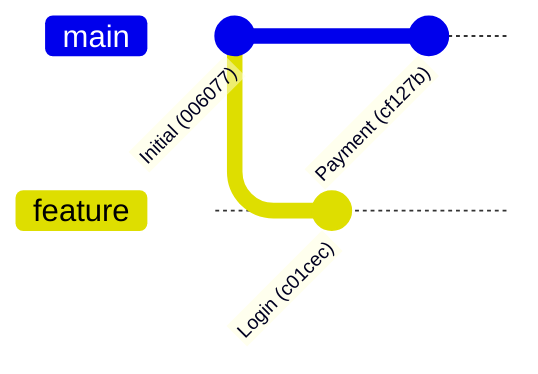
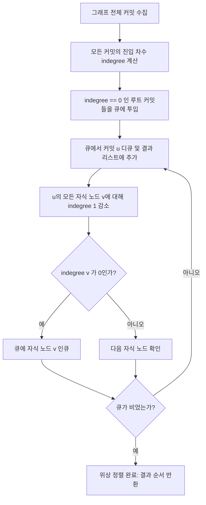
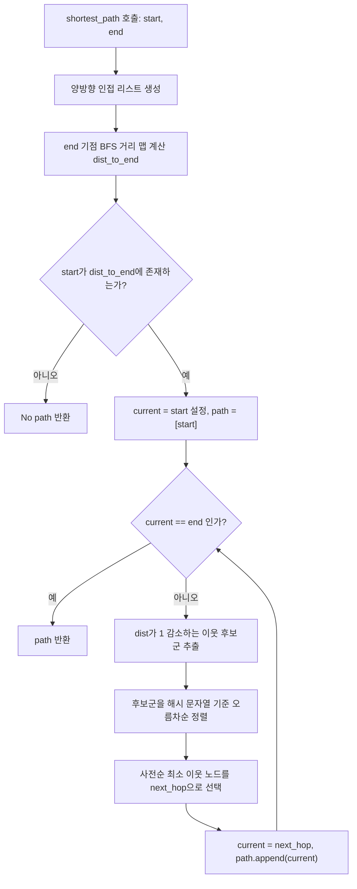
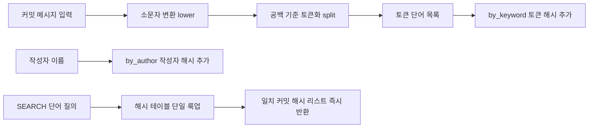

# Mini Git 프로젝트 종합 가이드 (Overview, Details & Architecture)

본 문서는 `b5_2` (CLI 기반 Mini Git) 프로젝트의 개요, 상세 구현 원리, 구현된 기능 목록, 전체 폴더 트리 구조 및 각 파일의 역할과 아키텍처를 종합적으로 정리한 완전 가이드입니다.

---

## 📌 1. 프로젝트 개요 (Project Overview)

- **과제명**: 파일이 언제 어떻게 바뀌었는지 기록하는 작은 프로그램 만들기 (CLI 기반 Mini Git)
- **분야 및 학습 주제**: AI/SW 기초 / 자료구조와 알고리즘 (Data Structures & Algorithms)
- **개발 환경 및 언어**:
  - Python 3.10 이상 권장
  - 외부 라이브러리 의존성 없음 (순수 Python 표준 라이브러리 `hashlib`, `datetime`, `shlex`만 사용)
- **프로젝트 핵심 목표**:
  - Git의 핵심 커밋 히스토리 모델을 외부 그래프 패키지 없이 밑바닥부터 직접 구현.
  - 커밋 정점과 부모 간선을 통한 **방향성 비순환 그래프(DAG)**를 구축하고, **Kahn 알고리즘 기반 위상 정렬 LOG**, **무방향 BFS 최단 경로(PATH)**, **사전순 타이브레이크**, **역색인(Inverted Index) 검색**, **안정 병합 정렬(Merge Sort)**을 완성도 높은 대화형 CLI 환경으로 구현.

---

## 🔍 2. 프로젝트 상세 (Project Details)

### 2.1 엄격한 라이브러리 제약 사항
- 학습 목적의 핵심 제약에 따라 NetworkX 등 외부 그래프 라이브러리의 사용이 일체 금지됩니다.
- Python 내장 정렬 API인 `sorted()`, `list.sort()`의 사용이 엄격히 금지됩니다.
- 인접 리스트 구축, BFS/DFS 탐색 큐/스택, 위상 정렬 진입 차수 계산, 분할 정복 병합 정렬, 역색인 테이블 등 모든 알고리즘과 자료구조는 100% 직접 구현되었습니다.

### 2.2 4대 핵심 아키텍처 원리
1. **커밋 DAG 및 불변 노드**:
   - 커밋 노드는 과거의 부모 노드만을 가리키므로 사이클이 물리적으로 생길 수 없는 비순환 구조를 보장.
   - 단조 증가 카운터와 솔트를 결합한 6자리 SHA-1 해시로 세션 내 유일성을 $100\%$ 보장.
2. **Kahn 알고리즘 기반 위상 정렬**:
   - 부모 커밋이 자식 커밋보다 항상 먼저 출력되는 위상 정렬 순서를 $O(V+E)$에 계산.
3. **무방향 최단 경로 및 결정론적 타이브레이크**:
   - 부모-자식 간선을 무방향으로 확장하여 분기된 브랜치 간 경로를 BFS로 탐색.
   - 동률 거리 경로 중 문자열 사전순으로 가장 앞서는 경로를 그리디 역추적으로 $O(V+E)$에 도출.
4. **역색인 기반의 $O(1)$ 검색 최적화**:
   - 커밋 메시지의 소문자 정규화 토큰과 작성자를 커밋 시점에 사전 색인화하여 검색 시 선형 스캔 비용 제거.

---

## ⚡ 3. 구현 기능 목록 (Implemented Features)

| 명령어 | 주요 기능 및 동작 규칙 | 시간 복잡도 | 출력 형식 |
| :--- | :--- | :---: | :--- |
| `INIT <user>` | 저장소 초기화, `main` 브랜치 생성, 현재 사용자 설정 | $O(1)$ | 초기화 결과 3줄 메시지 |
| `BRANCH <name>` | 현재 HEAD가 가리키는 커밋을 참조하는 새 브랜치 생성 | $O(1)$ | `Created branch: <name>` |
| `SWITCH <name>` | HEAD를 지정한 브랜치로 전환 (미존재 시 에러) | $O(1)$ | `Switched to branch: <name>` |
| `COMMIT <msg>` | 현재 HEAD를 부모로 하는 새 커밋 생성 및 역색인 갱신 | $O(W)$ | `[<branch> <hash>] <msg>` |
| `LOG` | 부모 커밋이 자식보다 항상 먼저 출력되는 위상 정렬 로그 | $O(V + E)$ | `commit <hash> (<author>, <timestamp>)\n<msg>` |
| `LOG --sort-by=date` | 타임스탬프 기준 오름차순 안정 정렬 로그 | $O(V \log V)$ | 커밋 포맷 목록 |
| `LOG --sort-by=author` | 작성자 기준 오름차순 안정 정렬 로그 (동일 작성자 생성순 보존) | $O(V \log V)$ | 커밋 포맷 목록 |
| `PATH <a> <b>` | 무방향 최단 경로 (사전순 최소 경로 선택, 없으면 No path) | $O(V + E)$ | `Path: a -> ... -> b` 또는 `No path` |
| `ANCESTORS <a>` | 해당 커밋에서 도달 가능한 모든 조상 커밋 출력 | $O(V_{anc} + E_{anc})$ | `Ancestors of <a>:\n- <hash>: <msg>` |
| `SEARCH <keyword>` | 키워드 포함 커밋 목록 역색인 기반 조회 | $O(1) + O(K)$ | `Found K commit(s):\n- <hash>: <msg>` |
| `SEARCH --author=<n>` | 작성자 커밋 목록 역색인 기반 조회 | $O(1) + O(K)$ | `Found K commit(s):\n- <hash>: <msg>` |

---

## 📁 4. 전체 프로젝트 폴더 구조 및 파일 역할

```
/Users/mpeg46551/b5_2/
├── main.py                     # CLI 진입점 (대화형 REPL 구동 및 호환 패키지 등록)
├── test_mini_git.py             # assert 기반 8대 전수 단위/통합 테스트 스위트
├── README.md                   # 프로젝트 메인 안내서 및 상호 참조 허브
├── READYOU.md                  # 구술 평가 대비 상세 대본 및 아키텍처 해설
├── GEMINI.md / AGENTS.md        # 전역 7대 운영 규칙 (100% 동기화)
├── src/                        # 핵심 소스코드 패키지
│   ├── __init__.py             # 패키지 익스포트 인터페이스
│   ├── commit.py               # Commit 노드 엔티티 (hash, message, author, parents 등)
│   ├── repo.py                 # Repository 클래스 (브랜치/HEAD/커밋 딕셔너리 관리)
│   ├── graph.py                # 그래프 알고리즘 (위상 정렬, BFS 최단 경로, DFS 조상 탐색)
│   ├── index.py                # InvertedIndex 클래스 (토큰 및 작성자 역색인)
│   ├── sorting.py              # merge_sort 함수 (분할 정복 안정 병합 정렬)
│   ├── cli.py                  # CLI 컨트롤러 (shlex 파싱, 명령 디스패치, REPL 루프)
│   └── GEMINI.md / AGENTS.md   # src 디렉터리 전용 규칙 파일
├── docs/                       # 미션 및 평가 문서 디렉터리
│   ├── b5_2_mission.pdf        # 미션 명세서 원본 PDF (불변 보존)
│   ├── b5_2_mission.md         # 미션 명세서 마크다운 변환본
│   ├── b5_2_mission_QA.md      # 미션 심층 질의응답서
│   ├── b5_2_eval.pdf           # 구술/실기 평가표 원본 PDF (불변 보존)
│   ├── b5_2_eval.md            # 구술/실기 평가표 마크다운 변환본
│   ├── b5_2_eval_QA.md         # 종합 평가문항 5대 항목 심층 답변서
│   ├── CONVENTIONS.md          # 커밋 및 코드 작성 컨벤션 지침
│   └── GEMINI.md / AGENTS.md   # docs 전용 규칙 파일
├── study/                      # 학습 및 아키텍처 문서 디렉터리
│   ├── README.md               # [본 문서] 프로젝트 종합 가이드
│   ├── study.md                # CS 핵심 개념 및 기술 용어 백과사전
│   └── GEMINI.md / AGENTS.md   # study 전용 규칙 파일
└── utils/                      # 하네스 검증 툴셋 디렉터리
    ├── validate_rules_sync.py  # 규칙 파일 100% 동기화 자동 검수기
    ├── validate_mermaid_syntax.py # Mermaid 문법 및 엣지 라벨 정합성 검사기
    ├── inspect_codebase_memory.py # Fast Lookup Map 자동 색인 생성기
    ├── time_utils.py           # KST 타임스탬프 유틸리티
    ├── scaffold_assignment_harness.py # 하네스 자동 배포 스캐폴더
    ├── README.md               # utils 패키지 설명서
    └── GEMINI.md / AGENTS.md   # utils 전용 규칙 파일
```

---

## 🎨 5. 단독 분리형 Mermaid 실행 아키텍처 다이어그램

### 5.1 커밋 DAG 및 브랜치 상태 천이도



### 5.2 위상 정렬(Kahn) 실행 흐름도



### 5.3 무방향 BFS 최단 경로 및 사전순 타이브레이크 흐름도



### 5.4 역색인 등록 및 검색 파이프라인



---

## 🔗 6. 상호 참조 링크 모음

- 📖 [README.md (프로젝트 메인 안내서)](../README.md)
- 📝 [b5_2_mission.md (미션 명세서 변환본)](../docs/b5_2_mission.md)
- 📝 [b5_2_mission_QA.md (미션 심층 Q&A)](../docs/b5_2_mission_QA.md)
- 🎯 [b5_2_eval.md (평가표 변환본)](../docs/b5_2_eval.md)
- 🎯 [b5_2_eval_QA.md (종합 평가문항 답변서)](../docs/b5_2_eval_QA.md)
- 📚 [study.md (CS 핵심 개념 백과사전)](study.md)
- 💡 [READYOU.md (구술 평가 대비 질문/답변서)](../READYOU.md)
