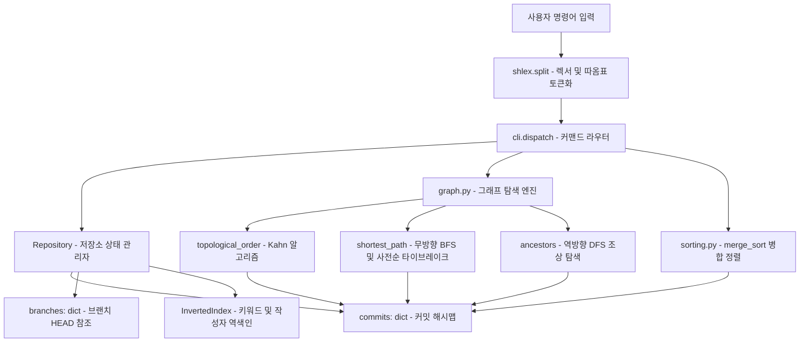
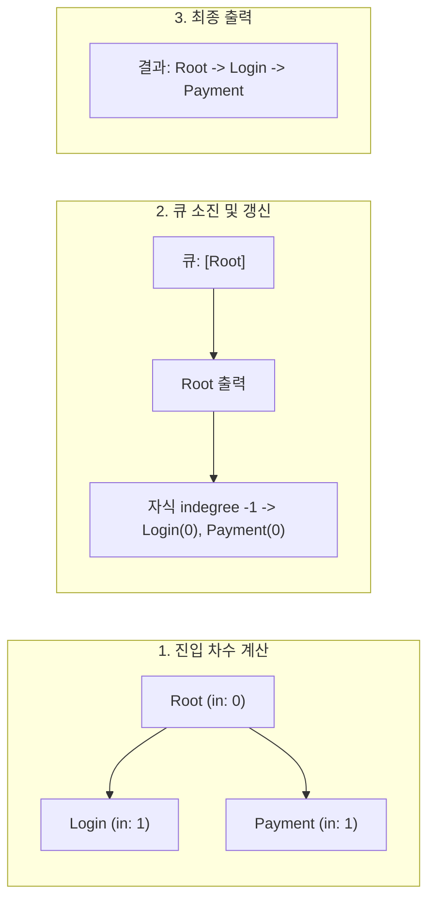

# Mini Git 핵심 개념 및 기술 용어 백과사전 (`study/study.md`)

본 문서는 [`docs/b5_2_mission.md`](../docs/b5_2_mission.md), [`docs/b5_2_mission_QA.md`](../docs/b5_2_mission_QA.md), [`docs/b5_2_eval.md`](../docs/b5_2_eval.md), [`docs/b5_2_eval_QA.md`](../docs/b5_2_eval_QA.md)에 기술된 모든 컴퓨터 공학 원리, 자료구조, 그래프 탐색 알고리즘, 정렬 복잡도, 역색인 및 Git 내부 철학을 체계적으로 집대성한 핵심 학습 지침서입니다.

---

## 📌 1. 상호 참조 링크 (Mutual Cross-References)

본 문서는 프로젝트 내 주요 가이드 문서 및 소스코드와 유기적으로 연동되어 있습니다:

- 📖 **프로젝트 메인 안내서**: [`README.md`](../README.md)
- 🏗️ **아키텍처 및 상세 실행도**: [`study/README.md`](README.md)
- 📝 **미션 수행 및 요구사항 심층 Q&A**: [`docs/b5_2_mission_QA.md`](../docs/b5_2_mission_QA.md)
- 🎯 **종합 평가문항 답변서**: [`docs/b5_2_eval_QA.md`](../docs/b5_2_eval_QA.md)
- 💡 **구술 평가 대비 질문/답변서**: [`READYOU.md`](../READYOU.md)
- 💻 **핵심 구현 소스코드**:
  - 커밋 노드 엔티티: [`src/commit.py`](../src/commit.py#L7-L38)
  - 저장소 및 형상 관리 엔진: [`src/repo.py`](../src/repo.py#L14-L75)
  - 그래프 알고리즘 (위상정렬 / BFS / DFS): [`src/graph.py`](../src/graph.py#L12-L121)
  - 역색인 검색 엔진: [`src/index.py`](../src/index.py#L10-L25)
  - 안정 병합 정렬: [`src/sorting.py`](../src/sorting.py#L12-L37)
  - REPL CLI 인터페이스: [`src/cli.py`](../src/cli.py#L54-L142)

---

## 🏢 2. 핵심 아키텍처 및 시스템 개요

### 2.1 분산 버전 관리 시스템(DVCS)과 Git의 코어 철학
- **분산 모델**: 중앙 집중식 VCS(SVN 등)와 달리, Git은 로컬 저장소 자체가 완전한 커밋 히스토리 그래프를 소유합니다.
- **스냅샷 기반 모델**: 변경 델타(Diff)를 연속적으로 누적하는 것이 아니라, 각 커밋 시점의 프로젝트 전체 메타데이터를 불변(Immutable) 노드로 캡처합니다.
- **그래프 기반 무결성**: 각 커밋은 고유한 암호학적 해시(SHA-1)를 식별자로 가지며, 부모 커밋의 해시를 노드 내부에 포함하여 조상-자손 관계를 불변의 방향성 비순환 그래프(DAG)로 엮어냅니다.

### 2.2 Mini Git 아키텍처 구조도



---

## 🧱 3. 핵심 자료구조 개념 및 심층 분석

### 3.1 방향성 비순환 그래프 (DAG, Directed Acyclic Graph)
- **개념**: 정점(Vertex)과 방향을 가진 간선(Directed Edge)으로 구성되며, 어떤 정점에서 출발하여 간선을 따라가도 자기 자신으로 돌아오는 순환 경로(Cycle)가 존재하지 않는 그래프.
- **Git 커밋에서의 적용**:
  - **정점($V$)**: [`Commit`](../src/commit.py#L7-L38) 객체 (고유 해시, 메시지, 작성자, 시각, 부모 목록).
  - **간선($E$)**: 자식 커밋에서 부모 커밋을 가리키는 포인터 (`child.parents = [parent_hash, ...]`).
- **DAG의 필연성 및 인과율(Causality)**:
  - 새 커밋 생성 시 부모는 반드시 이미 생성되어 있는 노드여야 합니다.
  - 미래의 커밋을 과거의 커밋이 부모로 삼을 수 없으므로, 시간 축의 비가역성에 의해 사이클 형성이 원천적으로 불가능합니다.
- **사이클 부재의 수학적 이점**:
  - 항상 최소 1개 이상의 위상 정렬 순서(Topological Order)가 존재함이 보장됩니다.
  - 모든 조상 탐색 및 그래프 순회에서 무한 루프 위험이 배제됩니다.

### 3.2 브랜치 포인터와 HEAD (Branch References & HEAD)
- **개념**:
  - 브랜치는 물리적인 커밋 복사본이 아니라, 특정 커밋 해시를 가리키는 **가변 포인터(Lightweight Movable Pointer)**입니다.
  - `HEAD`는 "현재 작업 공간이 체크아웃하고 있는 활성 브랜치"를 가리키는 심볼릭 참조입니다.
- **Mini Git 구현**:
  - `branches: dict[str, str | None]`: 브랜치 이름 $\to$ 최신 커밋 해시 매핑 ([`src/repo.py#L17`](../src/repo.py#L17)).
  - `current_branch: str`: 현재 체크아웃된 브랜치 이름 (`"main"`, `"feature"` 등) ([`src/repo.py#L18`](../src/repo.py#L18)).
- **동작 원리**:
  - `BRANCH feature`: 현재 브랜치가 가리키는 해시를 그대로 복사하여 딕셔너리에 새 키 추가 ($O(1)$).
  - `SWITCH feature`: `current_branch` 문자열만 교체 ($O(1)$).
  - `COMMIT`: 새 커밋을 생성하고 `branches[current_branch] = new_commit.hash`로 포인터를 전진 ($O(1)$).

### 3.3 역색인 (Inverted Index)
- **개념**: 문서(커밋) $\to$ 단어(키워드)의 정방향 매핑 대신, **단어(키워드) $\to$ 문서 목록(커밋 해시)**의 역방향 매핑을 미리 구축해 두는 정보 검색(Information Retrieval) 핵심 자료구조.
- **구현 구조**:
  - `by_keyword: dict[str, list[str]]`: 공백 분리 및 소문자 정규화된 토큰별 커밋 해시 리스트.
  - `by_author: dict[str, list[str]]`: 작성자 이름별 커밋 해시 리스트.
- **시간 복잡도 혁신**:
  - 순회 검색: 매 검색 시 $O(N \times L)$ (전체 커밋 수 $N$, 메시지 평균 단어 수 $L$).
  - 역색인 검색: 해시맵 단일 룩업 $O(1)$ + 일치 커밋 목록 반환 $O(K)$ ($K \ll N$).

---

## ⚡ 4. 핵심 그래프 및 정렬 알고리즘 심층 분석

### 4.1 Kahn 알고리즘 기반 위상 정렬 (Topological Sorting)
- **문제 정의**: "부모 커밋이 자식 커밋보다 항상 먼저 출력"되는 전체 커밋 선후 관계 정렬.
- **알고리즘 절차**:
  1. 모든 노드의 진입 차수(`indegree`: 부모 $\to$ 자식 방향으로 진입하는 간선의 수)를 계산.
  2. 부모가 없는 루트 커밋들(`indegree == 0`)을 큐에 삽입. (안정성을 위해 생성 순번 `order` 기준 사전 정렬).
  3. 큐에서 노드 $u$를 꺼내 결과 리스트에 추가하고, $u$의 모든 자식 노드 $v$에 대해 `indegree[v]`를 1씩 감소.
  4. `indegree[v] == 0`이 되는 순간 $v$를 큐에 투입.
  5. 큐가 빌 때까지 반복.
- **복잡도**: 시간 $O(V + E)$, 공간 $O(V + E)$.



### 4.2 무방향 너비 우선 탐색 (BFS) 최단 경로 & 사전순 타이브레이크
- **무방향 모델링**:
  - 두 브랜치(예: `feature`와 `main`)의 리프 노드 사이의 거리를 측정하기 위해 `adjacency[h].append(p)`와 `adjacency[p].append(h)`로 양방향 그래프를 구성.
- **BFS 최단 거리 맵**:
  - 도착점(`end`)을 기점으로 BFS를 실행하여 도달 가능한 모든 정점까지의 최단 홉 거리 `dist_to_end[v]`를 선계산.
- **그리디 사전순 역추적**:
  - 출발점(`start`)에서 목적지(`end`)로 이동할 때, `dist_to_end[neighbor] == dist_to_end[current] - 1`인 이웃들만 후보군으로 추출.
  - 후보군 중 해시 문자열 기준 오름차순으로 가장 작은 노드를 선택하여 전진.
  - **정당성 증명**: 모든 최단 경로는 동일한 홉 수 $D$를 가집니다. 문자열 `h1->h2->...->hD`의 사전순 크기는 첫 번째로 달라지는 정점의 사전순 크기에 의해 결정되므로, 매 홉마다 가장 작은 해시를 고르는 탐욕적 선택(Greedy Choice)은 전체 경로 문자열의 사전순 최솟값을 $100\%$ 보장합니다.

### 4.3 깊이 우선 탐색 (DFS) 기반 조상 커밋 추적
- **알고리즘**:
  - 스택을 활용하여 시작 커밋의 `parents`를 순회하며 부모의 부모를 재귀적으로 추적.
  - `seen: set[str]`을 활용하여 다이아몬드 머지 구조(여러 브랜치가 하나의 공통 조상을 공유)에서도 중복 방문을 $O(1)$에 차단.
- **복잡도**: 시간 $O(V_{anc} + E_{anc})$, 공간 $O(V_{anc})$.

### 4.4 분할 정복 병합 정렬 (Merge Sort)
- **알고리즘**:
  - 분할(Divide): 배열을 절반으로 재귀 분할 ($\lfloor N/2 \rfloor$).
  - 정복(Conquer): 분할된 하위 배열을 재귀 정렬.
  - 결합(Combine): 두 정렬된 배열을 포인터 $i, j$를 이용하여 선형 시간에 병합.
- **안정 정렬(Stable Sort)의 보장**:
  - `key(left[i]) <= key(right[j])` 비교 시 등호(`<=`)를 채택하여, 동일 키 값을 가진 원소 간에 원래 좌측에 있던 원소가 항상 먼저 결과 배열에 삽입되도록 보장.
  - 이를 통해 `LOG --sort-by=author` 시 동일 작성자의 커밋들이 최초 생성된 순서(`order`)를 온전히 보존.
- **점근적 복잡도**:
  $$T(N) = 2T(N/2) + O(N) \implies O(N \log N)$$
  최선, 평균, 최악 모두 $O(N \log N)$으로 퀵 정렬의 편향 피벗 문제($O(N^2)$)가 전혀 발생하지 않음.

---

## 🔒 5. 암호학적 해시와 고유성 보장 엔지니어링

### 5.1 SHA-1 다이제스트 & 6자리 압축
- SHA-1은 임의 길이의 바이트 스트림을 160비트(20바이트, 40자리 16진수) 고정 길이 다이제스트로 변환하는 단방향 해시 함수입니다.
- Mini Git은 CLI 가독성을 위해 상위 6자리 16진수(`digest[:6]`, $16^6 = 16,777,216$ 가지의 표현 공간)를 슬라이싱하여 사용합니다.

### 5.2 단조 증가 카운터 + 솔트 기반 결정론적 충돌 회피
- 생일 역설(Birthday Paradox)에 따르면 $16^6$ 공간에서도 약 4,000~5,000건의 커밋이 쌓이면 50% 확률로 해시 충돌이 발생할 수 있습니다.
- Mini Git은 이를 원천 차단하기 위해 **카운터(`_next_order`) + 솔트(`salt`)** 파이프라인을 구축하였습니다:
  ```python
  salt = 0
  while True:
      raw = f"{self._next_order}:{salt}:{message}:{timestamp}".encode("utf-8")
      digest = hashlib.sha1(raw).hexdigest()[:6]
      if digest not in self.commits:
          return digest
      salt += 1
  ```
- **효과**: 해시 충돌 발생 시 `salt`가 1 증가하여 즉각 새로운 해시를 탐색하므로, 해시 충돌로 인한 데이터 유실이나 덮어쓰기가 $100\%$ 방지됩니다.

---

## 💻 6. CLI REPL 아키텍처 및 렉싱/파싱

### 6.1 shlex 모듈을 이용한 셸 스타일 토큰화
- 일반적인 `line.split()`은 공백만을 기준으로 분리하므로 `COMMIT "Add login feature"` 입력 시 `["COMMIT", '"Add', 'login', 'feature"']`로 쪼개져 심각한 인자 오류를 유발합니다.
- `shlex.split()`은 셸 렉서(Lexer) 규칙을 준수하여 따옴표 내부의 공백을 문자열 리터럴로 온전히 보존하며 `["COMMIT", "Add login feature"]`로 파싱합니다.

### 6.2 명령 디스패치 및 에러 처리 표준화
- 명령어는 대소문자를 구분하지 않도록 `.upper()`로 정규화합니다.
- 저장소 초기화 여부(`initialized`)를 선행 검증하여 미초기화 명령을 차단합니다.
- 표준 에러 메시지(`Invalid args`, `Unknown branch: <name>`, `Unknown commit: <hash>`)를 철저히 분기 처리합니다.

---

## 📊 7. 복잡도 총괄 분석 매트릭스 (Big-O Matrix)

| 명령어 / 연산 | 핵심 알고리즘 및 자료구조 | 시간 복잡도 (Time) | 공간 복잡도 (Space) |
| :--- | :--- | :---: | :---: |
| `INIT <user>` | 저장소 및 딕셔너리 초기화 | $O(1)$ | $O(1)$ |
| `BRANCH <name>` | 브랜치 포인터 딕셔너리 복제 | $O(1)$ | $O(1)$ |
| `SWITCH <name>` | 활성 브랜치 문자열 전환 | $O(1)$ | $O(1)$ |
| `COMMIT <msg>` | SHA-1 해시 발급 및 역색인 등록 | $O(W)$ ($W$: 단어 수) | $O(W)$ |
| `LOG` (위상 정렬) | Kahn 알고리즘 (in-degree 기반 BFS) | $O(V + E) + O(V \log V)$ | $O(V + E)$ |
| `LOG --sort-by` | 분할 정복 병합 정렬 (Merge Sort) | $O(V \log V)$ | $O(V)$ |
| `PATH <a> <b>` | 무방향 BFS 최단 거리 및 그리디 복원 | $O(V + E)$ | $O(V + E)$ |
| `ANCESTORS <a>` | 스택 기반 깊이 우선 탐색 (DFS) | $O(V_{anc} + E_{anc})$ | $O(V_{anc})$ |
| `SEARCH <key>` | 역색인 해시맵 룩업 | $O(1) + O(K)$ ($K$: 일치 수) | $O(1)$ |

---

## 🚀 8. 대규모 시스템 확장성 및 프로덕션 엔지니어링

### 8.1 10만 건 커밋 환경에서의 성능 병목 및 해결책
1. **인접 리스트 온디맨드 빌드 병목**:
   - 현재 구현은 `shortest_path` 호출 시마다 전체 그래프의 무방향 인접 리스트를 매번 재구성합니다.
   - **해결책**: 커밋 생성 시점에 인접 리스트를 증분(Incremental) 업데이트하고 메모리에 상시 캐싱.
2. **양방향 BFS (Bidirectional BFS)**:
   - 두 노드 사이의 최단 경로 탐색 시, 출발지와 도착지 양쪽에서 동시에 BFS 큐를 전진시키면 탐색 공간이 $O(b^d)$에서 $O(2 \cdot b^{d/2})$로 지수적으로 축소됩니다.
3. **Commit-Graph 파일 디스크 영속화**:
   - 실제 Git 2.18+에 도입된 Commit-Graph 메커니즘처럼, 커밋의 부모 오프셋과 생성 시각, 세대 번호(Generation Number)를 고정 크기 바이너리 테이블로 디스크에 직렬화하여 $O(1)$ 랜덤 I/O로 탐색을 가속합니다.
